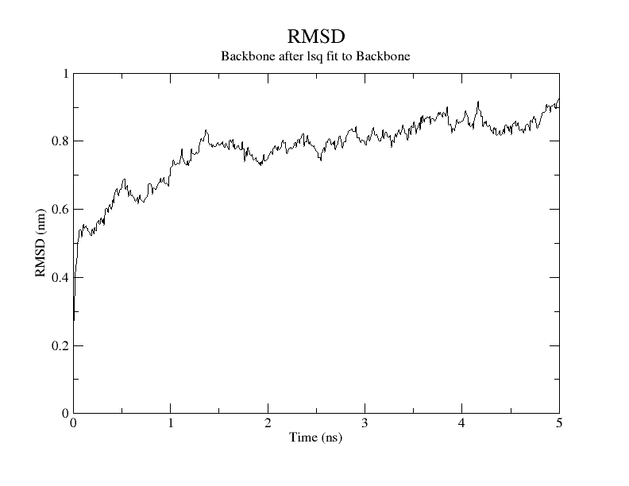
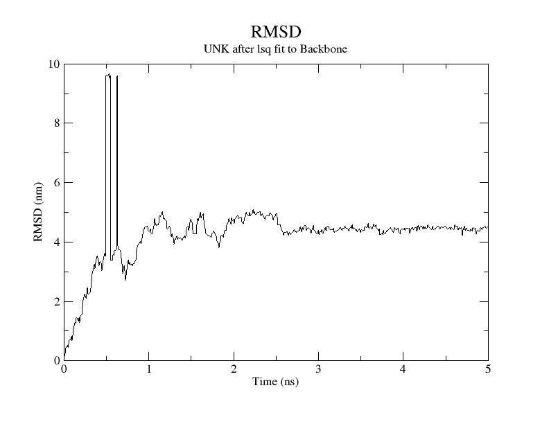
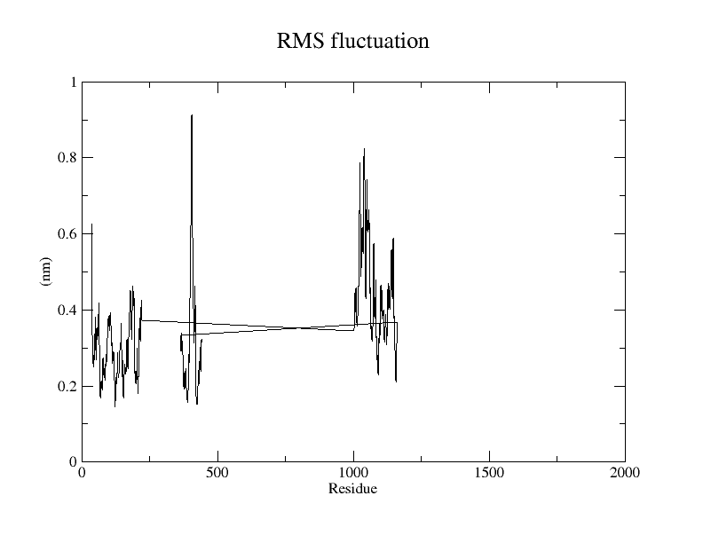
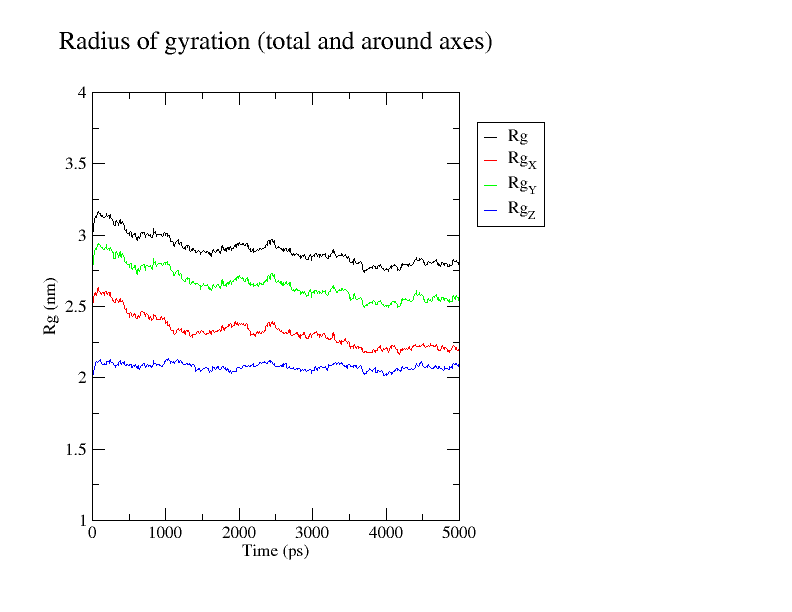
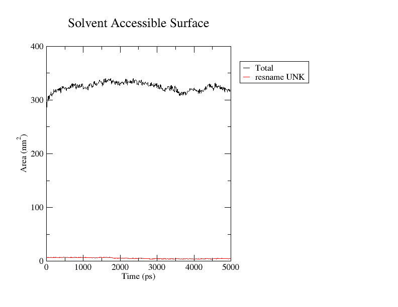
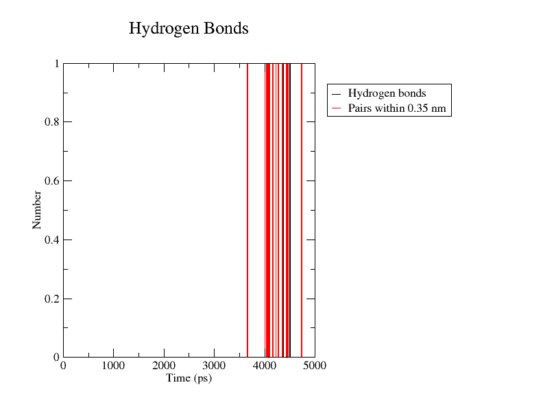
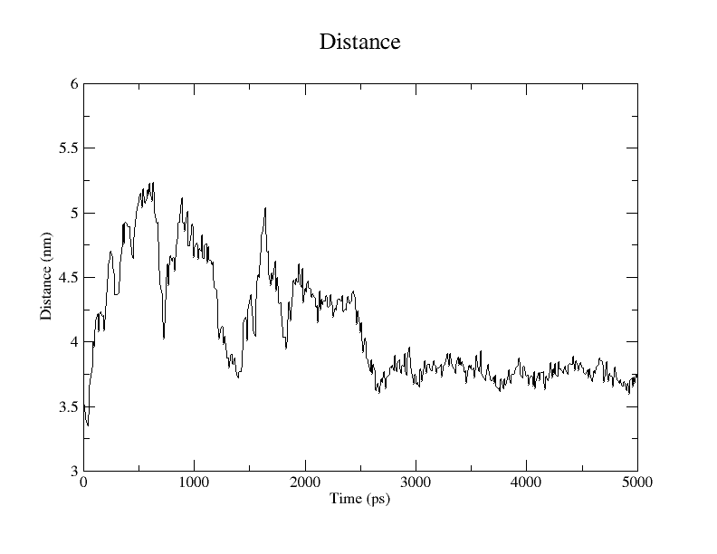
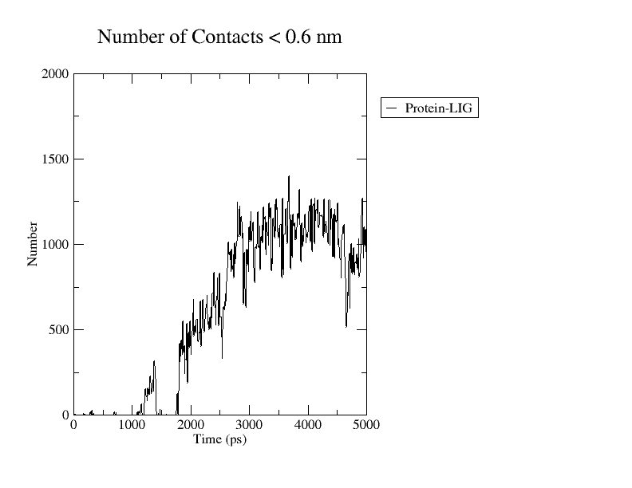
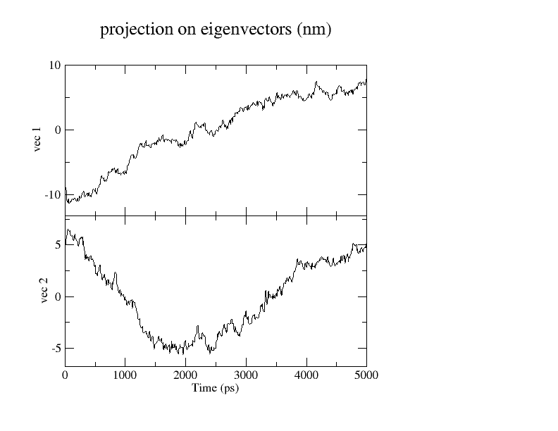
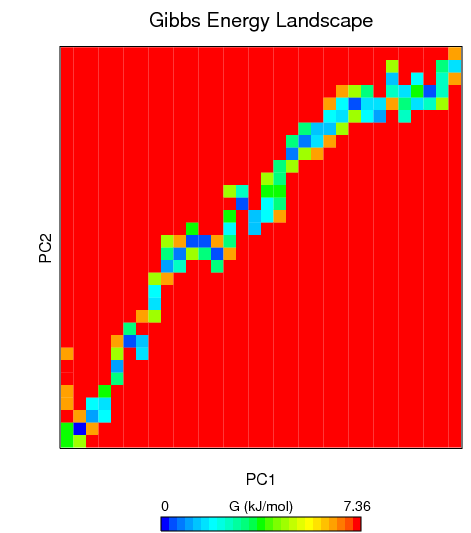

# 🧬 Molecular Dynamics (MD) Simulation of Risperidone–D2 Dopamine Receptor (6CM4)

## 🧠 Overview
This project presents a **Molecular Dynamics (MD) simulation** of the **Risperidone–D2 Dopamine Receptor complex** (PDB ID: **6CM4**).  
The simulation was conducted using **GROMACS** to investigate the **structural stability**, **compactness**, **surface accessibility**, and **binding interactions** between the receptor and the ligand across a **5-nanosecond trajectory**.

---

## ⚙️ System Setup

| Step | File | Description |
|------|------|-------------|
| 1 | `minimized_complex.gro` | Energy-minimized structure of the Risperidone–D2 receptor complex |
| 2 | `nvt.tpr` | NVT equilibration ensuring temperature stabilization |
| 3 | `npt.tpr` | NPT equilibration to maintain constant pressure |
| 4 | `md.tpr` | Production MD simulation (5 ns) |
| 5 | `topol.top`, `posre.itp` | Topology and restraint files used for the run |

---

## 📈 Post-Simulation Analyses

### 1. Root Mean Square Deviation (RMSD)
  

- **Files:** `rmsd.xvg`, `rmsd_lig.xvg`
- The **protein backbone RMSD** stabilized around **0.8 nm**, indicating structural equilibrium after initial fluctuations.  
- The **ligand RMSD** remained around **4–5 nm**, showing flexible yet retained binding within the pocket.  
- → **Conclusion:** The receptor reached dynamic stability, and the ligand maintained a consistent orientation.

---

### 2. Root Mean Square Fluctuation (RMSF)

- **File:** `rmsf.xvg`
- The RMSF plot revealed localized flexibility around **residues 900–1100**, likely corresponding to loop regions.  
- Most residues showed fluctuations below **0.4 nm**, suggesting overall backbone rigidity.  
- → **Interpretation:** Minimal fluctuations reflect a stable receptor conformation during binding.

---

### 3. Radius of Gyration (Rg)

- **File:** `gyrate.xvg`
- The average **Rg value (~2.9 nm)** remained stable throughout the trajectory.  
- Slight variations across RgX, RgY, and RgZ axes confirmed compact folding.  
- → **Conclusion:** The receptor complex retained structural compactness with no significant unfolding.

---

### 4. Solvent Accessible Surface Area (SASA)

- **File:** `sasa.xvg`
- SASA values fluctuated mildly around **300–350 nm²**, indicating minimal solvent exposure variation.  
- → **Interpretation:** The stable SASA profile supports consistent tertiary structure and solvent shielding.

---

### 5. Hydrogen Bonds (H-Bonds)

- **File:** `hbond.xvg`
- Hydrogen bonding between the receptor and Risperidone was relatively sparse but recurrent, averaging **1 bond** near 4 ns.  
- → **Insight:** Although transient, these H-bonds contribute to maintaining ligand anchoring within the pocket.

---

### 6. Protein–Ligand Distance

- **File:** `dist_LIG_PROT.xvg`
- The center-of-mass distance stabilized around **3.5–4 nm** after the initial 1 ns.  
- → **Interpretation:** The ligand settled into a stable binding pose with minimal drift.

---

### 7. Protein–Ligand Contacts

- **File:** `contacts_LIG_PROT.xvg`
- The number of atom–atom contacts (< 0.6 nm) increased sharply up to ~2000 and then plateaued.  
- → **Conclusion:** Formation of stable hydrophobic and polar interactions confirming persistent binding.

---

### 8. Principal Component Analysis (PCA)

- **Files:** `proj.xvg`, `pc1.xvg`, `pc2.xvg`
- PCA revealed significant motion along **PC1 and PC2** vectors, reflecting the global collective dynamics of the receptor.  
- → **Observation:** The transition between conformational states was limited, confirming an equilibrated ensemble.

---

### 9. Free Energy Landscape (FEL)

- **File:** `fel.xpm`
- The **Gibbs energy landscape** exhibited a major low-energy basin (blue–green region) suggesting a dominant, stable conformation.  
- → **Conclusion:** The system maintained a single energetically favorable state throughout the simulation.

---

## 🧩 Summary of Findings

| Analysis | Key Observation | Implication |
|-----------|----------------|-------------|
| RMSD | Stabilized after 1 ns | Structural equilibrium reached |
| RMSF | Minor flexibility | Stable backbone regions |
| Rg | Constant around 2.9 nm | Compact structure maintained |
| SASA | 300–350 nm² | Consistent solvent exposure |
| H-Bonds | Recurrent near 4 ns | Weak but stable interactions |
| Distance | Stable at 3.5–4 nm | Persistent ligand positioning |
| Contacts | Plateau ~2000 | Sustained receptor–ligand contacts |
| PCA / FEL | One major energy basin | Single stable conformation |

---

## 💬 Conclusion
The **Risperidone–D2 receptor complex** demonstrated remarkable **structural stability** and **binding persistence** over the 5 ns simulation.  
Minor fluctuations observed were confined to flexible loop regions, while the protein core and ligand maintained stable interactions.  
These findings suggest a **stable receptor–ligand complex**, supporting Risperidone’s affinity for the D2 Dopamine Receptor.

---

## 🧪 Tools & Environment
- **Software:** GROMACS 2024  
- **Force Field:** CHARMM36-jul2022  
- **Water Model:** TIP3P  
- **Simulation Length:** 5 ns  
- **Temperature:** 310 K  
- **Pressure:** 1 bar  
- **Visualization:** VMD & QtGrace

